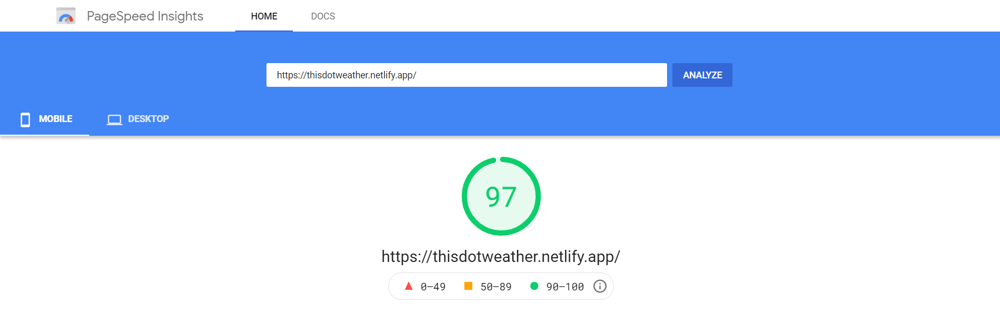
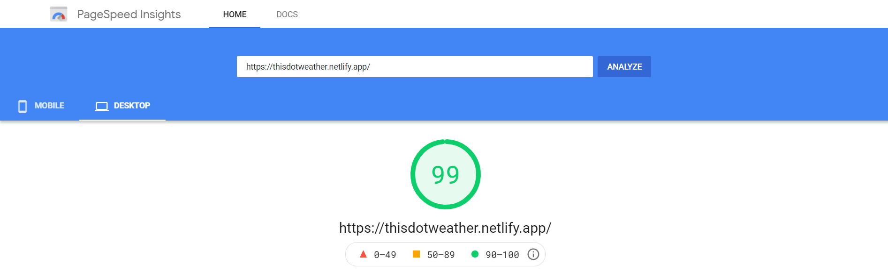
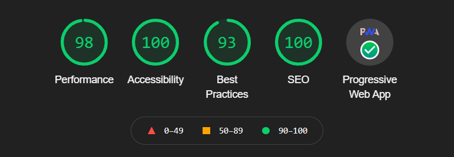

# 🎯 SkyLark Info
💡 Developed by <a href="https://github.com/jaideep25">Jaideep25</a>
 

>I wanted to learn how to make apps using React. So, I start my journey by simply create <a href="https://github.com/jaideep25/SkyLark">this</a> normal <a href="https://reactjs.org/">react website</a>. But later I came to know about <a href="https://web.dev/progressive-web-apps/">PWA</a> so I tried <a href="https://github.com/jaideep25/SkyLark">this</a> react project to convert it into a fully responsive react PWA.
After focusing on many minor details finally I made <a href="https://github.com/jaideep25/SkyLark">this responsive react PWA.</a>
 

⚙ <b style="letter-spacing:1.2px">Technology Used :</b>
<ul>
    <li>npm</li>
    <li>Webpack</li>
    <li>PWA</li>
    <li>HTML5</li>
    <li>SCSS</li>
    <li>react icons</li>
    <li>react Bootstrap</li>
    <li>React JS</li>
    <li>Fetch API</li>
    <li>lottie files</li>
    <li>Adobe Photoshop</li>
    <li>Adobe XD</li>
    <li>Github</li>
    <li>VS Code</li>
    <li>Chrome</li>
    <li>Netlify</li>
</ul>
 

# 📥 API
<b style="letter-spacing:1px">Weather data is retrieved from</b>
* Open Weather map: <a href="https://openweathermap.org/">openweathermap.org/</a>

* Current weather data: <a href="https://openweathermap.org/current">openweathermap.org/current</a>

* Weather Conditions: <a href="https://openweathermap.org/weather-conditions#Weather-Condition-Codes-2">openweathermap.org/weather-conditions#Weather-Condition-Codes-2</a>
 

# 📊 Latest PageSpeed Insights Score

 

# 📌 Latest Google Lighthouse audit

 